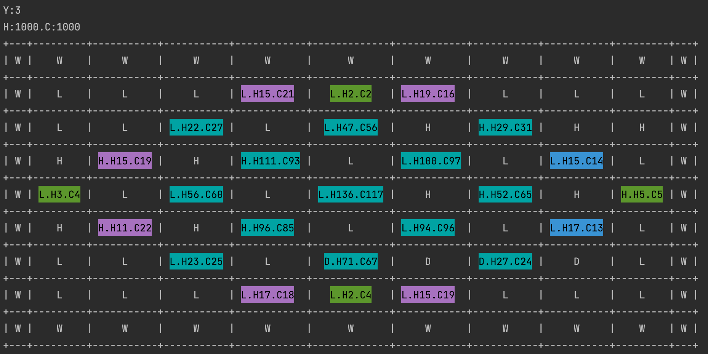
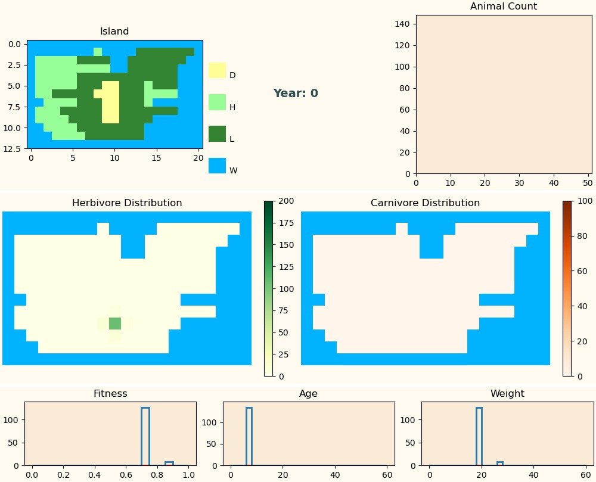
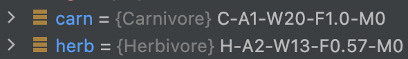

[](https://gitlab.com/nmbu.no/emner/inf200/h2022/january-block-teams/a39_sougata_tonje/biosim-a39-sougata-tonje/-/pipelines?page=1&scope=branches&ref=main) 
[](https://flake8.pycqa.org/en/latest/)
[](https://github.com/PyCQA/pylint)
[](https://www.python.org/)
[](https://www.sphinx-doc.org/) 
[](https://tox.wiki/en/latest/)

# Modelling the Ecosystem of Rossumøya

---

The project simulates life at the imaginary island of Rossumøya, given several initial parameters.
As a user and initializer you have the possibility to create an island of your choice with 
pre-defined values for the different parameters. Another option is to run simulations with the 
default set of parameters.  
In the `examples` folder you are presented with some examples of different 
types of simulations. What varies is the size of the island, the distribution of landscape types, 
and the distribution and initialization of animals. 

### How the simulation works
Defining the geography of the island:
```python
geogr = """\
           WWWW
           WLHW
           WWWW"""
```
Border can only be water, everything else can be either **Highland(H)**, **Lowland(L)**, or 
**Desert(D)**.

Initiating the population of the island:
```python
ini_herbs = [{'loc': (2, 2),
                  'pop': [{'species': 'Herbivore',
                           'age': 5,
                           'weight': 20}
                          for _ in range(50)]}]
ini_carns = [{'loc': (2, 3),
              'pop': [{'species': 'Carnivore',
                       'age': 5,
                       'weight': 20}
                      for _ in range(20)]}]
```
Choose the location, species and their age and weight. The rest of the parameters are taken from the 
default values, but can be changed and specified by the user (see example 3).

Initializing the simulation:
```python
for seed in range(100, 103):
    sim = BioSim(geogr, [ini_herbs and/or ini_herbs], seed=seed,
                 log_file=f'data/simulation_hc_{seed:05d}',
                 img_dir='data', img_base=f'simulation_hc_{seed:05d}', img_years=300)
```

The different parameters and what type of values that can be used is documented
[here](src/biosim/simulation.py) in `biosim/simulation.py`.

One can add animals and change parameters once a simulation is completed for a set of years.
It is then possible to restart simulation for another set of years with the new parameters. e.g.
```python
sim = BioSim(...)
sim.simulate(<some number of years>)
sim.add_population(<some extra population>)
sim.set_animal_parameters(<changed animal parameters>)
sim.set_landscape_parameters(<changed landscape parameters>)
sim.simulate(<a few more years>)
```
For further documentation and 
information about the different classes, parameters and possible restrictions is documented in each
file and package in the folder ```biosim```, [here](src/biosim).

---

## Content of the`examples`-folder
In this folder you have various python files, all containing code to run different types of 
simulations.

#### 1. `analyze_data.py`
[Python file here](examples/analyze_data.py).  
If you want to analyze previously saved logs, this file can be used to get this data visualized
in a plot. 

#### 2. `check_sim.py`
[Python file here](examples/check)
Same as the file in ```reference_examples```, but in this file we have added the ```make_movie()```-
method.

#### 3. `sample_sim.py`
Sample simulation with bigger island.


#### 4. `simulation_hc.py`
Simulation of island with Herbivores for 50 years, then adding Herbivores and simulation goes
on for 250 years.


#### 5. `simulation_hc_changed_params.py`
[Python file here](examples/simulation_hc_changed_params.py)   
Simulation of 10 years with only Herbivores, then Carnivores are added and the simulation goes on
for 251 more years (260 years in total). 

#### 6. `simulation_ho.py`
[Python file here](examples/simulation_ho.py).  
Simulation of a small island with only Herbivores. Logs the population count and statistics are
visualized in plots in a separate window.


#### 7. `simulation_migration.py`
[Python file here](examples/simulation_migration.py).   
Simulation of 7 years with both Herbivores and Carnivores initialized from year 0. Parameters have
been changed to ensure migration, so that we can verify that the migration works correctly.Map and
distribution of animals is shown in console, and statistics are visualized in a separate window.


#### 8. `simulation_migration_default_params.py`
[Python file here](examples/simulation_migration_default_params.py).
Simulation of 10 years with only Herbivores, then Carnivores are added and the simulation goes on
for 50 more years. Weight and age of animals are initialized, and the number of each fauna type.
Default parameters used. Map and distribution of animals is shown in console, and statistics are 
visualized in a separate window. Showing 59 years in total.

#### 9. `simulation_visual.py`
[Python file here](examples/simulation_visual.py).  
We simulate a period of 400 years. 
The initialized animals in year 0 are 200 Herbivores and 50 Carnivores. The movie found 
[here](Exam/simulation_visual.mp4) is the changes visualized per year from this simulation.


#### 1. Simulation with a default set of parameters
```
examples/simulation_migration_default_params.py
``` 
[Python file here](examples/simulation_migration_default_params.py).   
Simulation of 10 years with only Herbivores, then Carnivores are added and the simulation goes on
for 50 more years. Weight and age of animals are initialized, and the number of each fauna type.
Default parameters used. Map and distribution of animals is shown in console, and statistics are 
visualized in a separate window. Showing 59 years in total.

---


### Extra additions
#### 1. Colorful console output:
In `biosim/simulation.py`, an extra parameter has been added to the `BioSim`-instance parameters: 
`console_output_island`. Setting this to `True` enables print-out of island map in the console. 
Running ```examples/simulation.py``` ([here](examples/simulation_migration.py)) gives us the following output in the console for year 3:
{width=600 height=500px}  
The parameters in the mentioned file is set in a way so that we can observe that the migration 
for each animal in each cell works properly (following the set restrictions).

#### 2. Heatmap has water highlighted in blue:
The image below presents how the statistics from the simulation are visualized. In the two windows
showing the distribution of Herbivore and Carnivores, we have chosen to make the part of the map 
that is set to geography type *Water*, blue. 
The distribution is set by getting the details of the animals in each cell, and we then set the 
count of the animals = -1 where its water. While refreshing the heatmaps we set a mask on the cells where 
the number of animals is equal to -1 (which is done where there is geo type water on the map). 
In visuals.py, [here](src/biosim/visualization/visuals.py), the color of this mask is set to blue.
This ensures that the water areas are masked, and therefore blue, making the visualization better.
{width=600 height=500px}  

  
#### 3. Easier debugging:
We have added a string to the simulation, where information about each animal is easily registered
and updated for each annual cycle. This can be observed during debugging, as shown in the image 
below.   
{width=300 height=50}   
The letters indicate the following:

- **C** = Carnivore
- **H** = Herbivore
- **A** followed by number = Represents the age
- **W** followed by number = Represents the weight
- **F** followed by number = Represents the fitness
- **M** followed by 0 or 1 = Boolean value, telling us if the animal has moved or not 


### How to install and run
While in root file, run the following command in the terminal:
```python
python -m build
```
Then, all simulations in the `examples` folder will be runnable. 

### Results
All results and videos can be found in `examples/results`.

### Credits:
 - Code optimization done with Sourcery: https://sourcery.ai/

### License
[](LICENSE)

### Authors and contributors to the project
- Sougata Bhattacharya, sougata.bhattacharya@nmbu.no
- Tonje Martine Lorgen Kirkholt, tonje.martine.lorgen.kirkholt@nmbu.no