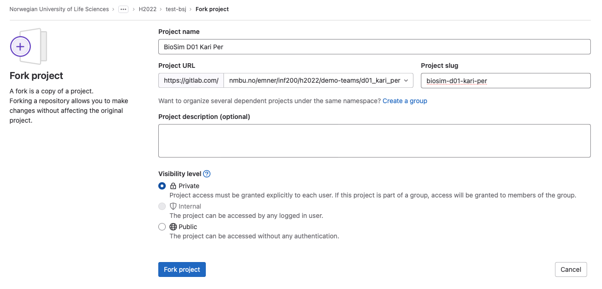

# Starting point for BioSim projects January 2023

1. Be sure that you are logged into Gitlab.
1. One of the partners clicks the `Fork` button.
1. Fill in the form that appears as follows (see also figure below):
   - Project name: `BioSim Axx FirstName1 FirstName2`  Here, `xx` is your group number (with leading zero!) and `FirstName1` and `FirstName2` your first names as in the group name.
   - In the project URL, in the "Select a namespace" pull-down menu, select your Gitlab group `Axx_FirstName1_FirstName2`. 
   - Make sure that the "Project slug" is `biosim-axx-firstname1-firstname2` without any spaces or additional hypyens. 
   - You can add a project description.
   - Select visibility level `Private`
1. The project is now created inside your group on Gitlab.
1. Both partners clone the project to their computers.
1. One partner shall replace this README.md with an initial text of your own and delete `fork_example.png`.

